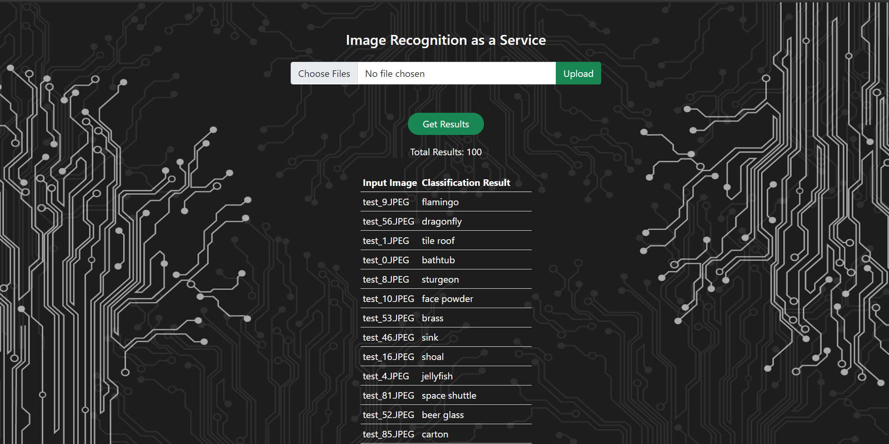

# Image Recognition as a Service

### Website Preview

----

## Problem Description 📋
⚡️ The project aims at building an elastic web application that can automatically scale out and scale in on-demand and cost-effectively by using cloud resources. \
⚡️ The resources used were from Amazon Web Services. It is an image recognition application exposed as a Rest Service to the clients to access. \
⚡️ The application takes the images and returns the predicted output by the deep learning model by using the AWS resources for computation, transportation, and storage. So the tasks involved designing the architecture, implementing RESTful Web Services, a load balancer that scales in and scales out EC2 instances at App Tier according to the demand of the user.

---

## Contributing 💡

#### Step 1

- **Option 1**
    - 🍴 Fork this repo!

- **Option 2**
    - 👯 Clone this repo to your local machine.

#### Step 2

- **Build your code** 🔨🔨🔨

#### Step 3

- 🔃 Create a new pull request.

## License
- **[MIT license](http://opensource.org/licenses/mit-license.php)**
